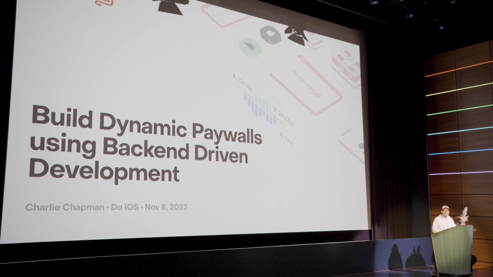

# Do iOS 2023

At [Do iOS](https://do-ios.com/) in Amsterdam, Charlie Chapman gave the talk **Build Dynamic Paywalls Using Backend Driven Development**.

You can find the full slide deck here:
* [Keynote](./2023-11-8%20Do%20iOS%20-%20Backend%20Driven%20Paywalls.key)
* [PDF](./2023-11-8%20Do%20iOS%20-%20Backend%20Driven%20Paywalls.pdf)

You can also find the full source code for the demo [here](./sample-code/). Note that this Xcode project connects to the API key for my demo RevenueCat project. To manipulate the offering metatadata json file for yourself, you can create your own [RevenueCat](https://www.revenuecat.com/) project and set your offering metadata to the example [json file](./sample-code/Backend%20Driven%20Paywalls%20Demo/Backend%20Driven%20Paywalls%20Demo/paywall-metadata-example.json) in this project.